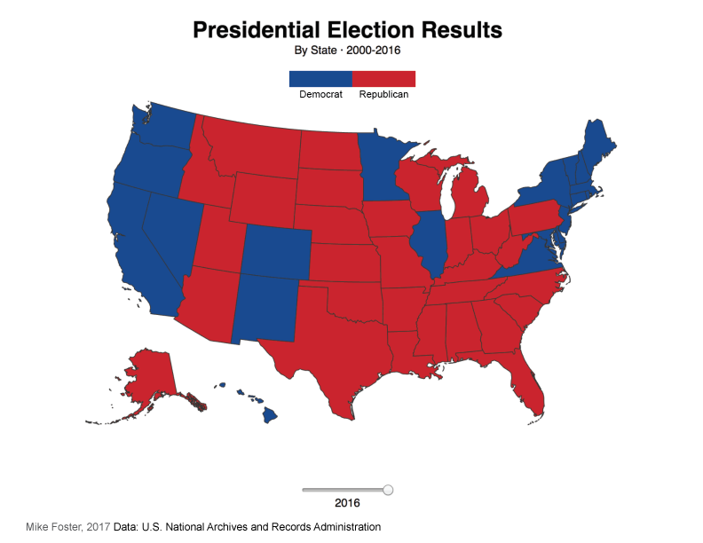

# Data Visualization with D3
## D3 Mapping: Create a Temporal Election Map

For the PSET this week, we are going to create an interactive map using state-level results of presidential election data from 2000-2016. This will utilize and build from the examples created during the in-class exercise.

We would like you to recreate the following map showing election map showing . In the **data/problem_set_data** folder on Github you will find a file for your use named **election_results_2000_2016.json**. Use this JSON for your visualization.

The JSON was created from records from the U.S. Electoral College datasets from the [U.S. National Archives and Records Administration](https://www.archives.gov/federal-register/electoral-college/historical.html).

You can take some liberty with your design, but should atleast include the following.

#### Requirements

1. Show Presidential Election Results for five election cycles. (2000, 2004, 2008, 2012, and 2016)
2. Use a Range Slider to navigate between the five elections.
3. Change the color of the state depending on the result, red should be republican, blue should be democrat.
4. Add an informative title, source, and supplemental information to your visualization.

### Help and Hints

Fields of relevance in **election_results_2000_2016.json** are:
	
* elect2000 - state-by-state results from November 2000
* elect2000 - state-by-state results from November 2004
* elect2000 - state-by-state results from November 2008
* elect2000 - state-by-state results from November 2012
* elect2016 - state-by-state results from November 2016

R - Republican
D - Democrat

* Data is from [National Archives and Records Administration](https://www.archives.gov/federal-register/electoral-college/historical.html)

You can refer to the slider example made in class for this exercise.

* [Slider Map Example - Mike Foster](http://duspviz.mit.edu/d3-workshop/examples/session4/boston-slider-map.html)

* Documentation on the range slider and what it returns are located here:

[http://www.w3schools.com/jsref/dom_obj_range.asp](http://www.w3schools.com/jsref/dom_obj_range.asp)
*Use console.log to see what values are being returned by the range slider.*

### In-class Exercise

In-class exercise for this week located at:
[http://duspviz.mit.edu/d3-workshop/mapping-data-with-d3/](http://duspviz.mit.edu/d3-workshop/mapping-data-with-d3/)